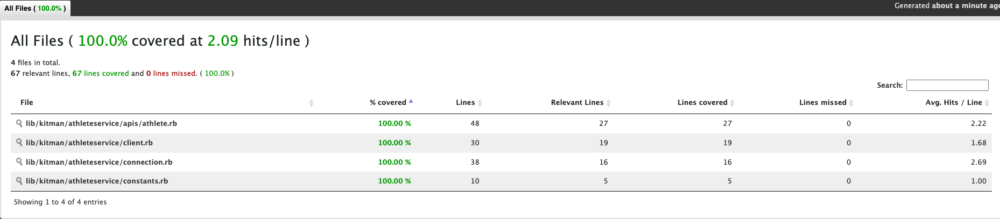

# Athlete Service

Gem to get data from AthleteService API.

```ruby
    client = Kitman::AthleteService::Client.new(
         client_id: 'CLIENT_ID',
         client_secret: 'CLIENT_SECRET'
    )
```

## Installation

Add this line to your application's Gemfile:

```ruby
gem 'athlete_service'
```

And then execute:

    $ bundle install

Or install it yourself as:

    $ gem install athleteservice


## Debugging with IRB

- Type `irb` in the console
- Load the file you want to debug e.g. `load './lib/kitman/athleteservice/client.rb'`. Note: you have to load the file for every change you make to the file

If you want to debug:
- Add `byebug` to your gemspec file
- Run `bundle install` to install the gem
- Add `require 'byebug'` to the top of the file you want to debug
- Comment `byebug` anywhere you want the debugger to stop

## Tests

The tests cover the client methods and include the following exceptions:

- When the client is initialized without credentials.
- If the request status is not 200 when calling the AthleteService API to get the data.

Additionally, I added:
- The `webmock` gem to mock requests to the APIs.
- Also the `simplecov` gem to create coverage report.



Command to run the tests: `rspec ./spec/kitman/athleteservice/client_spec.rb`